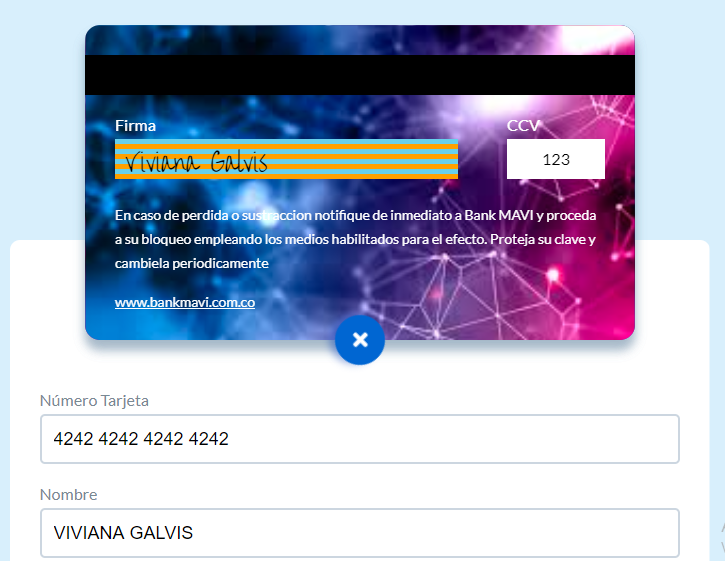
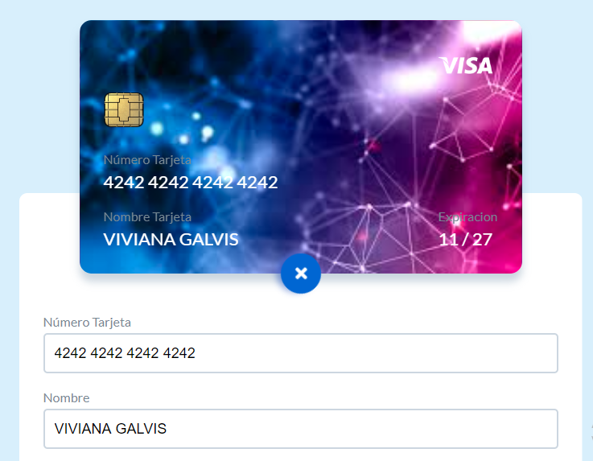

BANCO MAVI💳 
<figure>

<figcaption>Vista principal</figcaption>
</figure>

## Índice

* [1. Descripción del proyecto](#1-Descripción-del-proyecto)
* [2. Investigación UX](#2-Inventigación-UX)
* [3. Objetivos de aprendizaje](#3-objetivos-de-aprendizaje)

***

## 1. Descripción del proyecto

Por medio de está aplicacíon deseamos darle facilidades de consultar su cupo, movimientos, etc a nuestros clientes sin necesidad de desplazarse a la sede mas cercana, si no desde la comodidad de su hogar, trabajo etc.

## 2. Investigación UX

1. Explicar quiénes son los usuarios.

  Los usarios son todos nuestros clientes que tienen productos activos en nuestro banco, con el objetivo facilitar a nuestros clientes la consulta de sus movimientos, extractos, cupo, etc.

2. Explicar cómo el producto soluciona los problemas/necesidades de dichos
  usuarios.

  El problema que van a solucionar los usuarios de esta aplicación es evitar largas filas o tener que desplazarse hasta una sucursal cerca para hacer consultas basicas de su producto T.C

  3. Luego colocarás la foto de tu primer prototipo en papel.

  4. Agregar un resumen del feedback recibido indicando las mejoras a realizar.
  5. Imagen del prototipo final.

  <figure>

<figcaption>Vista tarjeta</figcaption>
</figure>

<figure>

<figcaption>Vista formulario</figcaption>
</figure>

<figure>

<figcaption>Vista tarjeta trasera</figcaption>
</figure>

## 3. Objetivos de aprendizaje

Trabajando en parejas aprenderán a construir una aplicación web que interactuará
con lx usuarix final a través del navegador, utilizando HTML, CSS y JavaScript
como tecnologías.

Reflexiona y luego marca los objetivos que has llegado a **entender** y
**aplicar** en tu proyecto.

### UX

* [X] Diseñar la aplicación pensando y entendiendo al usuario
* [X] Crear prototipos para obtener feedback e iterar
* [X] Aplicar los principios de diseño visual

### HTML y CSS

* [X] Uso correcto de HTML semántico
* [X] Uso de selectores de CSS
* [X] Construir tu aplicación respetando el diseño realizado (maquetación).

### DOM

* [X] Uso de selectores de nodos del DOM
* [X] Manejo de eventos del DOM
* [ ] Manipulación dinámica del DOM

### Javascript

* [ ] Manipulación de strings
* [X] Uso de condicionales
* [X] Uso de bucles
* [X] Uso de funciones
* [ ] Datos atómicos y estructurados
* [ ] Utilizar ES Modules (`import` | `export`).

### Testing

* [ ] [Testeo de tus funciones]

### Git y GitHub

* [X] Comandos de git (`add` | `commit` | `pull` | `status` | `push`).
* [X] Manejo de repositorios de GitHub (`clone` | `fork` | `gh-pages`).

### Buenas prácticas de desarrollo

* [X] Organizar y dividir el código en módulos (Modularización).
* [X] Uso de identificadores descriptivos (Nomenclatura | Semántica).
* [X] Uso de linter para seguir buenas prácticas (ESLINT).
